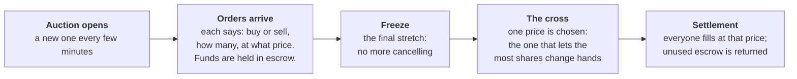

# Uncross

**Fair fills for tokenized stocks when the market is thin and Wall Street is closed.**

Uncross is a trading venue on Solana for tokenized US equities (xStocks such as
AAPLx and IBMx). Instead of trading against a pool whose price moves with every
order, orders are collected for a few minutes and then all filled together at
one fair price.

- **Live app:** https://uncross.0xo.in
- **Program:** `Gk9ZUMqPcNuF3PduisUZXBffUP7cCrfnBSCAyTdpjYGP` (Solana mainnet and devnet)
- Built for the Stocklana hackathon (Solana Foundation), September 2026.

## The problem

Tokenized US stocks trade on Solana around the clock, but most tickers have only
a few thousand dollars of liquidity, so an ordinary-sized order moves the price
against the person placing it. Outside US market hours there is often no live
reference price to trade against, and for many tickers — IBM, for one — there
is no on-chain price at all.

Measured on mainnet while building this: the IBMx pool held about $1,400, and a
$1 swap moved its price by 0.58%.

## How it works

Every trade in an auction happens at **one price**, whatever each person bid or
asked. That price is the one at which the most shares can change hands. If more
than one price does that equally well, Uncross prefers the one where buying and
selling interest is most balanced, then the one nearest the live Pyth price if
the market is open, then the middle of the range.

A real auction from testing, so the rule is concrete:

| Order | Price | Shares | Result at the clearing price of **$247.50** |
|---|---|---|---|
| Sell | $240.00 | 10 | Sells all 10 — receives $247.50 each, $7.50 more than asked |
| Buy | $250.00 | 10 | Buys all 10 — pays $247.50 each, and gets $25 back |
| Sell | $245.00 | 5 | Not filled; shares returned |
| Buy | $243.00 | 8 | Not filled; money returned |

Nobody trades at a worse price than they asked for, and nobody gets a worse
price than anyone else in the same auction. Before the cross, the app shows the
price the auction would clear at right now, updated with every new order.

While US markets are open, the app shows Pyth's live price next to Uncross's
clearing price. When they are closed, it says so — and for tickers with no
on-chain Pyth price at all, the auction's own book is the price.

## What this doesn't solve

Uncross holds your shares and dollars in escrow between placing an order and
settlement. That escrow sits under the token issuer's rules, not only ours.

- **The issuer can pause the token.** Every xStock mint can be paused by its
  issuer. While paused, nothing can move those shares — not settlement and not
  refunds. Uncross fails safely (nothing is half-settled, and everything is
  refunded once the pause lifts), but it cannot give you your shares back
  during a pause. Dollar refunds still work.
- **The issuer can take tokens from any account, including escrow.** Every
  candidate mint has a "permanent delegate": the issuer can move or burn
  tokens in any account without the holder's signature. That is a regulatory
  control built into these assets. It applies to shares waiting in an Uncross
  auction exactly as it applies to your own wallet.
- **The issuer could add a transfer rule later.** The mints have a transfer-hook
  setting that is currently switched off. If an issuer switched it on, every
  settlement transaction would need more accounts and fewer orders would fit in
  each one.
- **Pyth keeps publishing after the 4pm ET close**, apparently extended-hours
  prices. Uncross accepts a Pyth price as a reference only when it is fresh and
  precise, but it cannot tell a regular-session price from an extended-hours one
  on-chain — the on-chain Pyth account carries no trading-session field.
- **Some tokenized stocks don't work.** PreStocks tokens charge a 0.5% fee on
  every transfer, which the escrow accounting does not handle, so they are not
  supported.
- **Account rent is not reclaimed yet.** Each auction and each order creates a
  small Solana account whose deposit (about $2–3 per auction) stays locked;
  there is no close instruction yet.

**Not yet tested:**

- The Pyth tie-break has been checked against real price data in unit tests, but
  its first live use on-chain is the mainnet demo — there is no live Pyth equity
  price on devnet to test against.
- The largest book tested had 42 orders; the maximum is 64.
- Settlement batches were measured at 7 orders per transaction (with every order
  from a different wallet). A full book needs about 10 settlement transactions;
  address lookup tables would raise that limit and are not used yet.
- Nothing here has been audited.

## Open-source components

Uncross is built on open-source software and uses it as-is:

- **On-chain program:** [Anchor](https://github.com/coral-xyz/anchor) (`anchor-lang`,
  `anchor-spl`), which brings in the Solana program libraries and the SPL Token
  and Token-2022 crates; [bytemuck](https://github.com/Lokathor/bytemuck).
- **Scripts and keeper:** `@coral-xyz/anchor`, `@solana/web3.js`, `@solana/spl-token`.
- **Web app:** React, Vite, the Solana wallet adapter, and the libraries listed
  in `web/package.json`.
- **Prices:** [Pyth Network](https://pyth.network) price accounts are read
  directly on-chain; no Pyth SDK is used.

Everything else — the auction program, the clearing algorithm, the keeper, and
the web app — was written for this project.

## Repository

| Path | What it is |
|---|---|
| `uncross/programs/uncross/` | The on-chain program (Rust, Anchor) |
| `uncross/scripts/keeper.mjs` | Opens auctions on a schedule and runs the cross and settlement |
| `uncross/scripts/devnet-*.mjs` | End-to-end tests against devnet |
| `web/` | The web app |
| `docs/` | Research and test logs, with transaction signatures |

The test logs in `docs/` record every run that backs the claims above,
including the three accounting bugs found and fixed along the way
(`docs/phase2.md`).
