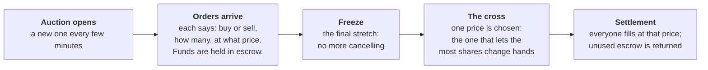

# Uncross

**One price for everyone, even when the market is thin.**

Uncross is a call auction on Solana for tokenized US equities (xStocks such as
AAPLx and IBMx). It gathers everyone who wants to trade a thin tokenized stock
into the same few minutes and fills them all at one price, instead of leaving
each person to walk an empty pool alone.

- **Live app:** https://uncross.0xo.in — Solana devnet
- **Program:** `Gk9ZUMqPcNuF3PduisUZXBffUP7cCrfnBSCAyTdpjYGP` on devnet
- Built for the Stocklana hackathon (Solana Foundation), September 2026.

## The problem

Tokenized US stocks trade on Solana around the clock, but most tickers have only
a few thousand dollars of liquidity, so an ordinary-sized order moves the price
against the person placing it. A reference price is easy to find; the ability
to trade at it is not.

Measured on mainnet on 16 September: Jupiter published $247.14 for IBMx, whose
pool held $1,666, and found no route to buy it at $10,000, at $100, or at $1.
JPMx filled a $100 buy 2.5% above its reference and had no route at $1,000.
There is no Pyth price account for IBM on Solana at all. The full measurement,
and why Pyth's AAPL price is a guard rather than a source of liquidity, is in
[`docs/pyth.md`](docs/pyth.md).

## How it works

Every trade in an auction happens at **one price**, whatever each person bid or
asked: the price at which the most shares can change hands. If several prices
do that equally well, Uncross prefers the one where buying and selling interest
is most balanced, then the one nearest a fresh Pyth price, then the middle of
the range.

A real auction from testing, so the rule is concrete:

| Order | Price | Shares | Result at the clearing price of **$247.50** |
|---|---|---|---|
| Sell | $240.00 | 10 | Sells all 10 — receives $247.50 each, $7.50 more than asked |
| Buy | $250.00 | 10 | Buys all 10 — pays $247.50 each, and gets $25 back |
| Sell | $245.00 | 5 | Not filled; shares returned |
| Buy | $243.00 | 8 | Not filled; money returned |

Nobody trades at a worse price than they asked for, and nobody gets a worse
price than anyone else in the same auction. Before the cross, the app shows the
price the auction would clear at right now, updated with every new order.

## What it runs on, and why that is the strongest test

Uncross runs on Solana devnet against **fixture mints built to be
extension-identical to the real xStocks**. Here is how that was established.

**1. The real mint, read live.** The AAPLx mint on mainnet
(`XsbEhLAtcf6HdfpFZ5xEMdqW8nfAvcsP5bdudRLJzJp`) was read directly with
`getAccountInfo`, not from documentation. It is a Token-2022 mint with 8
decimals and eight extensions, the ones every candidate xStock carries.

**2. The fixture, built to match.** The devnet fixture
(`BvgVkJawYWrWV2eu5ousJUvGWwbgDTUdyr9vBM27BYYG`) was created with the same
extensions and read back the same way:

| Property | Mainnet AAPLx | Devnet fixture | Match |
|---|---|---|---|
| Token program | spl-token-2022 | spl-token-2022 | yes |
| decimals | 8 | 8 | yes |
| freezeAuthority | set | set | yes |
| `defaultAccountState` | `initialized` | `initialized` | yes |
| `permanentDelegate` | set | set | yes |
| `transferHook` | present, `programId: null` | present, `programId: null` | yes |
| `confidentialTransferMint` | present, `autoApproveNewAccounts: false` | present, `autoApproveNewAccounts: false` | yes |
| `scaledUiAmountConfig` | present | present | yes (value differs, below) |
| `pausableConfig` | present, `paused: false` | present, `paused: false` | yes |
| `metadataPointer` | present, self-pointing | present, self-pointing | yes |
| `tokenMetadata` | present | present | yes |
| `transferFee` | not present | not present | yes |
| `nonTransferable` | not present | not present | yes |

**3. The four fields deliberately not reproduced:**

1. **Authority keys.** Every authority on the fixture belongs to us, not the
   issuer. That is the point — see below.
2. **The scaled-UI multiplier's starting value.** Mainnet AAPLx sits near 1.003;
   the fixture starts at 1 so the multiplier test has a clean before/after.
3. **Supply.** Whatever we mint; irrelevant to the program.
4. **The metadata URI.** Nothing on-chain reads it.

An IBMx fixture (`9aGoR5JbatqRYbc4SpQuT3pWVLPhZQJvDq26FFb23Jzp`) replicates the
real IBMx mint the same way, including its live multiplier of 1.0153. The full
comparison is in [`docs/devnet-fixture.md`](docs/devnet-fixture.md).

**4. What the fixture made testable.** Two of the most important failure modes
of these assets can only be tested with a mint you control, because on mainnet
those authorities belong to the issuer. Nobody but Backed Finance can pause
AAPLx or change its multiplier. With the fixture, both were run for real:

- **The issuer pauses the token mid-auction.** Settlement failed cleanly with
  nothing half-settled, dollar refunds went out while the token was still
  paused, share refunds went out after it resumed, and both escrow vaults ended
  at exactly zero.
  Signatures: [refund while paused](https://explorer.solana.com/tx/4DNRgi4M1aXGQd7GajCDk3XrVEoznDRu5kqUojdhL5Ek1A2mTpG3DZaXoDCHBjYMTdtE8oQ4YFfAar2CZBBPGxbZ?cluster=devnet),
  [refund after resume](https://explorer.solana.com/tx/2r9ANErSqUQUzQLSQwwbrJvwDwZXkGr6uwCeFUkh4QdWWh6ew9JJc4gVEBixbD1RfGkHmZ4ztQ5LDY9GNpP1eNB7?cluster=devnet).
- **The issuer changes the multiplier mid-auction** (how xStocks express a
  stock split). The multiplier was doubled between order entry and the cross.
  Every fill and refund came out exactly as predicted beforehand, because
  Uncross keeps raw token amounts only; the wallet display doubled, the
  accounting did not move.
  Signatures: [multiplier 1.0153 → 2](https://explorer.solana.com/tx/uWkV19hzfH1kcjHxwBKTUNqvCHs7SnHo7B46BdZDEMALSDsLUZoN9qbgAdQhLjBUqsY7SZg4hvQJGjvnWEaZm4v?cluster=devnet),
  [cross](https://explorer.solana.com/tx/5H6bFXTHyaBveTcNoQdzVWRF6kTbpCy5ejjTzBgVxZDendpfR6GeZdmGNVrKJ67cJ4yZHkS8RGjUfdDKTg9n2hp9?cluster=devnet),
  [settlement](https://explorer.solana.com/tx/5bmP3jkqpcujvMMPrU5aqCivJudXQwxy6Hffn8M7jgZVKqVfFSHpfPkcm7rvHRGyW7ETCPyYscSeidALh85wbvMa?cluster=devnet).

The same fixture carried the largest settlement test: 42 orders from 42
different wallets, settled in seven-order batches deliberately out of order,
with a duplicate batch that paid nothing twice. Both vaults ended at exactly
zero, and every wallet's balance change matched its fill to the unit. Details
and every signature are in [`docs/phase2.md`](docs/phase2.md).

**The reference price comes from mainnet, read-only.** The app shows Pyth's
AAPL/USD price read directly from its account on Solana mainnet, and says so on
screen; auctions clear on devnet. Pyth has no live AAPL price on devnet — the
only devnet account is months stale — so the auction's Pyth tie-break (the third
rule above) never runs on-chain here. It is covered by unit tests built from the
real mainnet price account's bytes. There is no IBM price on either network, so
for IBMx the auction book is the only price there is. Since 16 September every
auction also records on-chain what the gate decided at its cross, and the
publish time of the price it examined, so any cross can be audited afterwards.

## What this doesn't solve

Uncross holds your shares and dollars in escrow between placing an order and
settlement. That escrow sits under the token issuer's rules, not only ours.

- **The issuer can pause the token.** While paused, nothing can move those
  shares — not settlement and not refunds. Uncross fails safely (nothing is
  half-settled, and everything is refunded once the pause lifts), but it cannot
  give you your shares back during a pause. Dollar refunds still work.
- **The issuer can take tokens from any account, including escrow.** Every
  xStock mint has a "permanent delegate": the issuer can move or burn tokens in
  any account without the holder's signature. That regulatory control applies
  to shares waiting in an Uncross auction exactly as it does to your wallet.
- **The issuer could add a transfer rule later.** The mints have a
  transfer-hook setting that is switched off today. Switching it on would add
  accounts to every settlement and shrink how many orders fit in each
  transaction.
- **Pyth keeps publishing long after the 4pm ET close.** Checked every five
  minutes on 15–16 September, 80 times from 4:11 PM ET to 2:49 AM ET (10 hours
  38 minutes): at every check the AAPL price account's latest print was at most
  14 seconds old, and the price kept moving. Pyth's own schedule called the
  market closed that entire time. The feed polled was `Equity.US.AAPL/USD`
  (`49f6b65c…`), the one the program and the app bind to, not the 24/7
  `Equity.Index.AAPL/USD` variant. The on-chain account carries no
  trading-session field, so a thin extended-hours print and a liquid
  regular-session one cannot be told apart on-chain. An earlier draft of this
  README said "no reference price" was true overnight; that is retracted — the
  measurement disproves it. Weekends were not measured.
- **Tokens with transfer fees don't work.** PreStocks tokens charge 0.5% on
  every transfer, which the escrow accounting does not handle, so they are not
  supported. Their mints were verified live, and custody works, but the fee
  would leave escrow short.
- **Order deposits are not reclaimed.** Each order creates a small account
  whose rent, paid by the trader, stays locked. Auction rent is reclaimed:
  since 16 September `close_auction` returns an auction's rent and both vaults'
  rent to whoever paid it, but only once every order is settled and both vaults
  are exactly empty; it refuses anything else. On devnet it refused an auction
  mid-window, one cleared but unsettled, one partially settled, one with a
  stray token in a vault, and a wrong rent recipient, then closed a finished
  one. Opening, crossing, settling and closing an auction now costs about
  0.00002 SOL net. Auctions created before that upgrade have no recorded payer,
  so they can never be closed and their rent stays locked permanently.

**Not yet tested:**

- The Pyth tie-break on-chain (unit tests only, for the reason above).
- A real browser wallet signing. The app's transaction code was driven end to
  end on devnet with local keys standing in for the wallet.
- A full order book. Capacity is 63 orders (down from 64, to make room for the
  rent payer); the largest tested had 42.
- Nothing here has been audited.

## Open-source components

Uncross is built on open-source software and uses it as-is:

- **On-chain program:** [Anchor](https://github.com/coral-xyz/anchor) (`anchor-lang`,
  `anchor-spl`), which brings in the Solana program libraries and the SPL Token
  and Token-2022 crates; [bytemuck](https://github.com/Lokathor/bytemuck).
- **Scripts and keeper:** `@coral-xyz/anchor`, `@solana/web3.js`, `@solana/spl-token`.
- **Web app:** React, Vite, the Solana wallet adapter, and the libraries listed
  in `web/package.json`.
- **Prices:** [Pyth Network](https://pyth.network) price accounts are read
  directly on-chain; no Pyth SDK is used.

Everything else — the auction program, the clearing algorithm, the keeper, and
the web app — was written for this project.

## Repository

| Path | What it is |
|---|---|
| `uncross/programs/uncross/` | The on-chain program (Rust, Anchor) |
| `uncross/scripts/keeper.mjs` | Opens auctions on a schedule and runs the cross and settlement |
| `uncross/scripts/create-devnet-fixture.sh` | Builds the extension-identical fixture mints |
| `uncross/scripts/devnet-*.mjs` | End-to-end tests against devnet |
| `web/` | The web app |
| `docs/` | Research and test logs, with transaction signatures |

The test logs in `docs/` back every claim above, including the accounting bugs
found and fixed along the way (`docs/phase2.md`).
